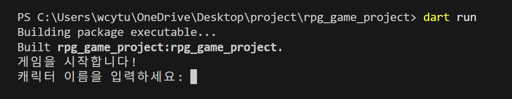
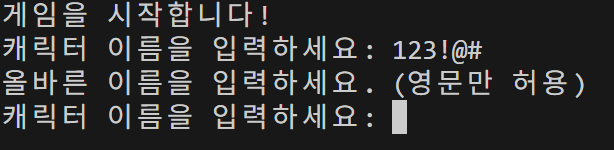
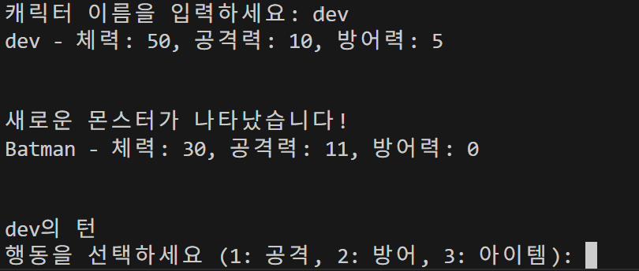
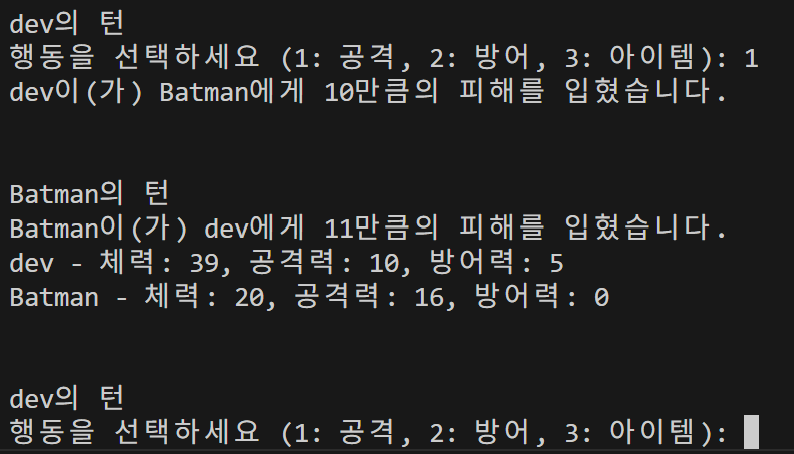
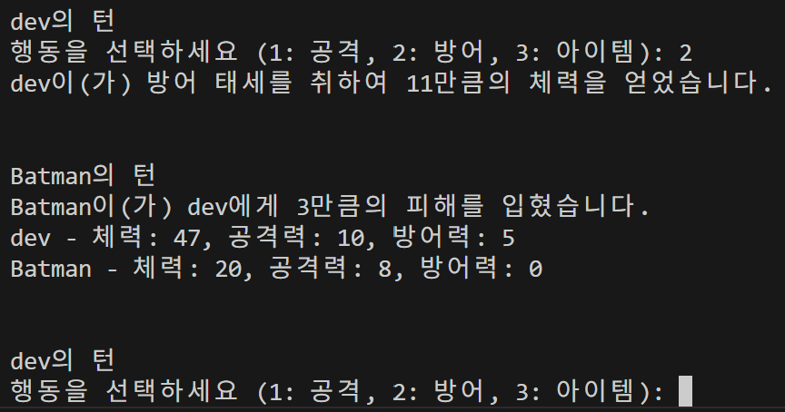
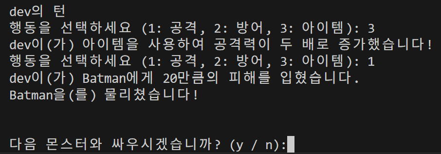
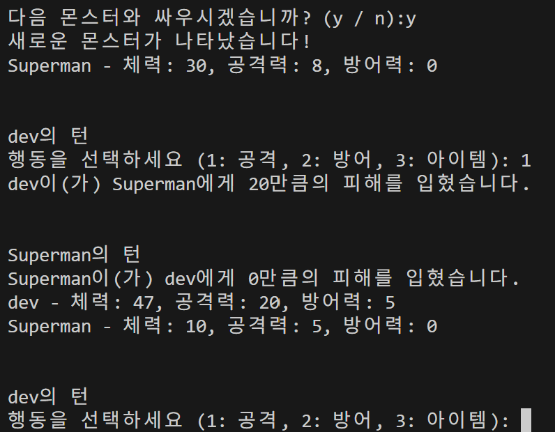
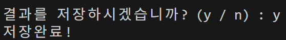

# CLI기반 RPG게임 입니다.
  

dart run으로 실행합니다.
영문으로 이름을 입력합니다.
  

  
한글, 특수문자, 숫자는 입력이 불가합니다
  

  
유저가 할 수 있는 행동은 총 3가지
- 공격
- 방어
- 아이템 사용

이 있습니다.
  
  
공격을 하게 되면 본인의 공격력 - 적의 방어력 만큼의 피해를 입힙니다.  
몬스터도 공격을 한번수행합니다. 

  
  
방어를 하게 되면 몬스터의 공격력 - 본인의 방어력 만큼의 수치를 회복합니다.  
이후 몬스터가 공격을 수행합니다.

  

  
아이템을 사용하게 되면 한번만 공격력이 두배가 됩니다.  
아이템은 한 몬스터당 한번만 사용 가능합니다.
  

  
몬스터는 여러마리가 있고 몬스터를 처치하면  
다음 몬스터를 상대할지 정할 수 있고  
체력은 그대로 이월됩니다.
  

  
주어진 몬스터를 전부 처치하게 되면 승리하며 게임이 종료됩니다.
게임결과를 저장할 수 있습니다.

